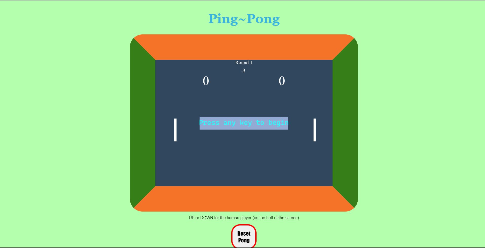
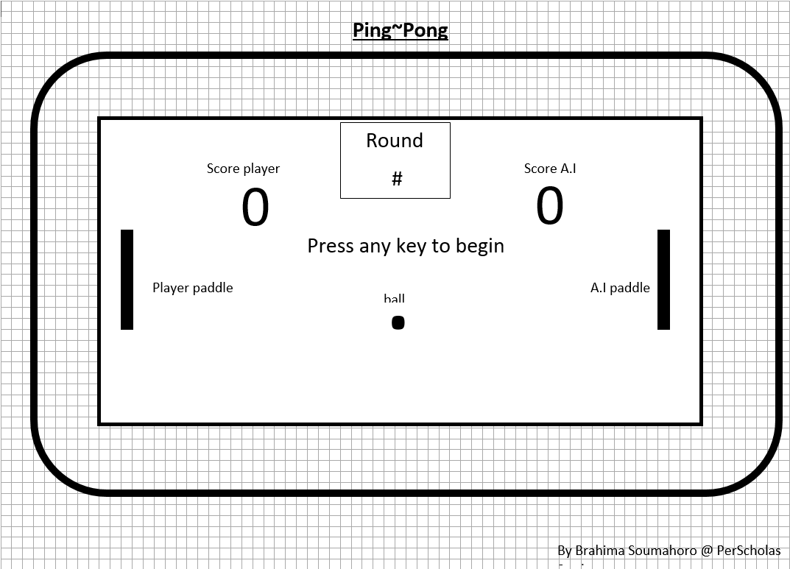

# **The Ping~Pong** 

## Introduction
created in 1972
by Atari founder Nolan Bushnell
 , his version of this concept, as an arcade game. A small company at the time, Atari began manufacturing the games in an old roller skating rink, and by the end 1972 the company had sold more than 8,000 Pong arcade machines. 

# The Rules of Pong
## The Goal
The only goal of this game is to try and get the ball past your opponent's paddle. The first player to score the Maximum points in a round wins the round and the more round the player wins he wins the game. Each round, the ball will be served by the player who scored last.

## The Players 
In this game the players are comprised of one human versus an Artificial intelligence (A.I)  
A.I on the right  
Human on the left  

## The Game
Every time the human player wins a round the background color will change randomly. If the A.I wins the game is over.  
There are 3 match rounds going from the 3 sets to 2 sets the 1 set, the match round gets faster with every human win. 
It is set on auto resting within 2 seconds after a game ends and a winner is declared. 
The reset pong button is just for show. 

  

## Resources
https://google.com  
https://perscholas.org  
<u>__Perscholas:__</u>  * classes   * Recordings   * Classmates   * The Wellness Support Team   * Last but not least the instructors  
 
# Read
* The Computer Programming Bible
* Mastering Javascript Premium Edition 
* The complete Reference of C#
* The C Bible

## Wireframe

  

